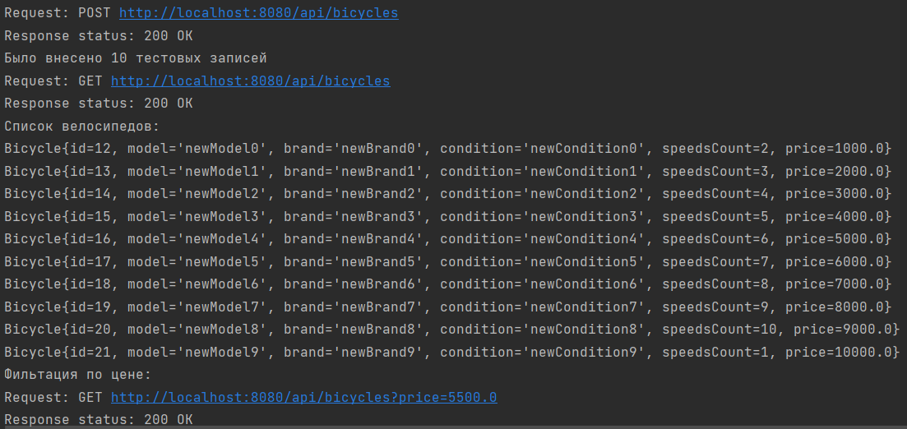
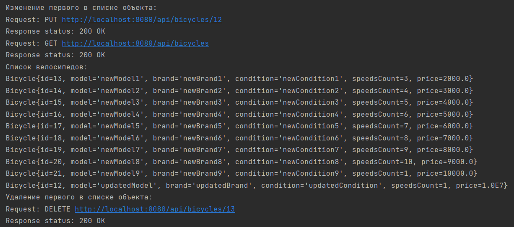
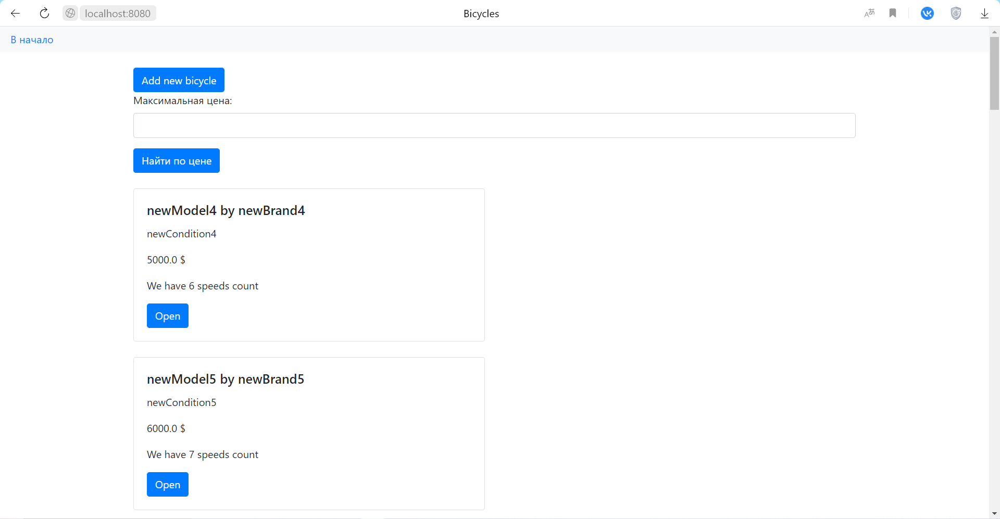
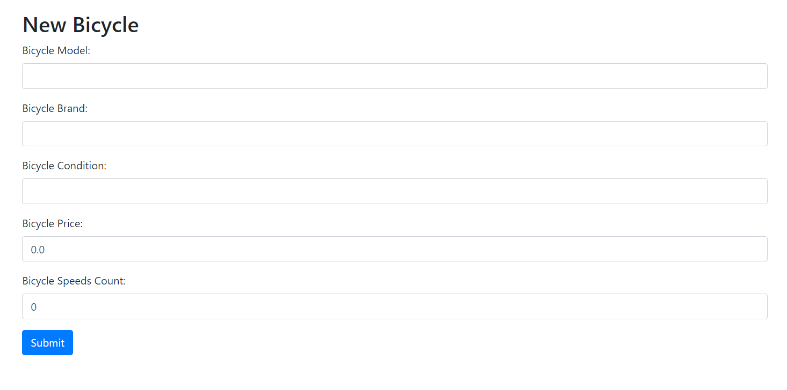

# Практическая работа №7
### Архитектура REST
## Цель работы:
Ознакомиться с механизмами поддержки архитектуры REST в Spring.
## Общая постановка задачи:

Изменить приложение из практического задания №6 (или №5, на усмотрение студента, т.к. при работе с защищенным приложением могут возникнуть трудности) и добавить следующий функционал:

1) Преобразовать веб-приложение таким образом, чтобы оно поддерживало архитектуру REST. Должны поддерживаться следующие типы запросов: GET (показ html и извлечение json всех/одной записей/сущностей), POST (добавление), PUT (редактирование), DELETE (удаление).

2) Разработать REST-клиент для приложения, который с использованием RestTemplate позволяет выполнять базовые операции по извлечению (GET), добавлению (POST), редактированию (PUT), удалению (DELETE) ресурсов. REST-клиент не обязан иметь графический пользовательский интерфейс, необходим репрезентативный тестовый пример, который можно запускать из окна терминала.

3) Обязательным условием является сохранение всего предшествующего функционала приложения. Для удовлетворения всем характеристикам REST- архитектуры приложение может быть реорганизовано (убраны GET-запросы с параметрами) или добавлен новый функционал.

4) PUT- и DELETE-запросы не обязательно делать из браузера. Достаточно реализации для клиентов-приложений.

Результат работы - tar.gz-архив или текстовый файл со ссылкой на репозиторий (код проекта должен содержать документирующие комментарии) с инструкциями по развертыванию приложения/приложений и его зависимостей, а также по использованию. Необходимо указать, какая именно из предыдущих работ модифицировалась. Работа должна быть защищена преподавателю. Защита состоит в пояснении хода действий для решения поставленной задачи и ответов на теоретические вопросы или вопросы, возникающие у преподавателя в ходе проверки работы.

## Вариант задания:
Вариант 8: Велосипед

## Сборка и запуск:

Понадобится Maven и jdk версии 17, postgresql 15.4. Переходим в папку проекта, в ней переходим в папку Back и выполняем следующие команды:

Создание базы данных производится в папке Back:
```
psql -U postgres -h localhost -f create_db.sql
```
Сборка серверной части - ввод следующей команды в папке Back:
```
sh mvnw package
```
Запуск серверной части так же производится в папке Back:
```
java -jar target/lab7Back-0.0.1-SNAPSHOT.jar
```
Теперь возвращаемся в корневую папку проекта и переходим в папку Client

Сборка клиентской части из папки Client:
```
sh mvnw package
```
Запуск клиента из папки Client:
```
java -jar target/lab7Client-0.0.1-SNAPSHOT.jar
```
Для клиента были реализованы все crud операции. При запуске и сборке клиента тестовые 
операции автоматически выполняются, 
подтверждая работоспособность программы, поэтому сборку и запуск клиентской части стоит выполнять 
при условии запущенного сервера. После этого пользователь может обращаться со своими запросами.



_Тестовые запросы_

Смена кодировки в случае некорректного отображения руссих букв:
```
chcp 65001
```
Загруженный сайт находится по адресу:
```
http://localhost:8080
```
Документация в postman находится по ссылке:
https://documenter.getpostman.com/view/30539611/2s9YeN2UA8

## Примеры использования:

_Внешний вид главной страницы_


_Добавление нового велосипеда_


